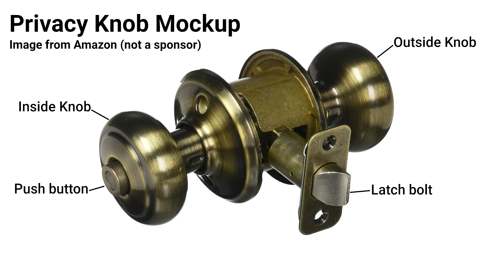

# Fall in LOVE with Unit Testing

Slides live at <https://world-class-engineers.github.io/utahjs-2023-unit-testing>

Joe Skeen \
UtahJS 2023

## Sizzle

Let's be honest, when you hear "unit testing", does it make your stomach turn
a little? You're not alone, but there is hope. Join me for a fresh take on unit
testing, so you can go from fear to felicity. Are you ready to fall in LOVE with
unit testing?

## Intro

Hello everyone and welcome to Falling in LOVE with Unit Testing. My name is Joe Skeen,
and I've been writing code for nearly 30 years, starting from a very young age, and have 
used a multitude of languages and frameworks. My absolute driving passion is helping 
engineers across the software development community stay excited about doing software 
development, and to keep learning and growing throughout their careers. One of my favorite 
topics to teach when doing mentorships or trainings is unit testing, and over the years I've
developed an approach to unit testing that not only has improved how I write tests,
but also how I write all of my code. It has changed my attitude towards writing tests
from being a chore to a sheer delight. Today I hope I can show you how to shed your
fear of unit testing and become a happier, more well-adjusted software engineer.

## Unit testing is important

Throughout my career, I have encountered very few developers who don't think
that unit testing is valuable. There are so many benefits to unit testing,
including, but not limited to:

* Early bug detection and Regression prevention through Continuous Integration,
* Ability to refactor code more confidently,
* A more well-thought-through design leading to better code quality,
* Living Documentation,
* and more

In today's world with AI tooling becoming more readily available, it's important to
remember that one of the most important things we contribute to our work as developers is 
our focused thought. We are paid for our abilities of how we think. But we also need a good 
way to validate what we think. Sure, we may think we understand everything about our program 
now, but what about in a year, when we have been off working on other projects? As we spend 
the time to write quality test cases, it helps to challenge assumptions and focus our 
implementation on solving the right problems in the right way.

This quote from Trish Khoo, Director of Engineering at Octopus Deploy, sums it up pretty well:

“The more effort I put into testing the product conceptually at the start of the process,
the less effort I [have] to put into manually testing the product at the end because fewer
bugs ... emerge as a result.”

## Unit testing is uncomfortable for many

At the same time, though, an overwhelming majority of the engineers I have encountered
throughout my career didn't actually feel comfortable writing unit tests. But why is that?

I've heard stories where management at a company makes an edict that an arbitrary
amount of code coverage must be maintained on the code base. For developers in this 
situation that are inexperienced with unit testing, this can lead to a lot of negative
experiences.

I've heard that a lot of other people feel too much pressure from their boss, stakeholders,
etc. to deliver on a tight deadline that they don't feel they have enough time to test.
But if testing helps prevent regressions and detect bugs early, wouldn't that mean
that doing testing actually saves time, not spends it?

After giving this a great deal of thought I've come to the conclusion that most developers 
are uncomfortable with unit testing simply because they never learned how to do it well.

I mean, think about it: some developers are self-taught. I was in that category in my
early career, and I can tell you that the thought never crossed my mind that learning how
to do unit testing was an essential skill I needed to pick up. I hadn't even really heard
the term "unit test" until I was in college earning my CS degree. But even then, as a CS
student, I didn't feel like I really understood what unit testing was, and why it was
important for me to do. More recently I've talked with many colleagues who received their
CS education through a fast-paced boot camp. Those programs are mostly designed to teach
just enough that a student can land their first CS job, and unit testing rarely falls on
that critical path. So no wonder unit testing doesn't come naturally to any of us. Most 
of us haven't had a good chance to learn how to become really good at it.

My journey to becoming a unit testing evangelist began at my first job out of college. My
manager, Sheldon Hancock, organized a book club amongst the development team to study
"The Art of Unit Testing" by Roy /Osh-e-rove/. It was through this discussion and study that
I became excited about unit testing, an excitement that has only grown over the past decade
or so. I was very fortunate to have good mentors early in my professional career to show me
the joy of unit testing, and before long I found myself teaching others what I had learned.

Before diving into the four keys to unit testing success, let's quickly clarify what a unit
test is, and how it differs from other types of testing. A unit test is a test in which you
are able to isolate a small piece of code from the rest of the application and test it under
a variety of circumstances to verify the correct behavior of that component. Although other
types of testing including integration and end-to-end testing have their place, unit testing
should be the types of tests you invest most heavily in. The more parts of your application
are involved in a test case, the more likely that a new feature or change will break the test,
leading to constant fixing of those tests. A unit test, once written correctly, should only
have to change if the requirements for that one specific piece of code change; thus well-
written unit tests have a lower maintenance cost than other kinds of tests, and a greater
return on investment over time.

Let's discuss the four keys I have found to being successful in unit testing:

## Key 1: Break it down into distinct use cases to understand the problem you are solving

Unit testing is a process of reconciling our product requirements with reality. It is, at its
core, identifying how our code should behave, not just when things go as planned, but defining
behavior for unexpected circumstances as well. As we begin to tease these use cases apart, we 
gain a deeper understanding of the problem we are solving and leave our code well-equipped to
handle whatever the user will throw at it.

Sometimes, before I even start writing any code or tests, I'll sit down and think about
what my code will do. I'll draft up a series of statements of what a given function, when
in a variety of circumstances, should do. To illustrate this, let's take an everyday object
that most people should be familiar with: a door.

While conceptually simple, a door system is comprised of a number of components:

* The wood panel (the door itself),
* The door frame,
* The hinges,
* The doorknob,
* and sometimes, a door stopper to prevent damage to a nearby wall

For this example, let's take a single component of the door and define its expected
behavior: the doorknob; specifically, let's talk through a simple interior locking doorknob,
called a privacy knob, such as one you may have on your bedroom or bathroom door.

Before defining the behavior, it's helpful to define the "nouns" of your component, as it
helps you establish a shared vocabulary with others who will read this specification. I found 
this image on Amazon (not a sponsor) that illustrates the kind of knob I have in mind, then
annotated it with the terms that I will use to describe the parts of it:



* the Outside knob
* the Inside knob
* the Push button
* and the Latch bolt

I'm not going to include the latch plate, since it's exterior to the door knob component,
being part of the door frame. In practice, this would be external to your unit, and you
would want to mock it out, if needed, for your test case.

With our nouns defined, let's write our first use case.

> A privacy doorknob, when the push button is not pressed, when the user turns the inside
> knob, should also turn the outside knob.

For some of you out there, you may be familiar with BDD, or Behavior-Driven Development,
and so you may think to write this sentence in the Given/When/Then syntax. Let's try that:

> **GIVEN** the push button is not pressed \
> **WHEN** the user turns the inside knob \
> **THEN** the outside knob should also turn

Writing a use case in either of these ways helps to clearly define what the situation is 
and the expected behavior, and removes ambiguity to the point that you will start seeing 
other similar use cases. For example, for the first use case's situation, there is another
thing I would expect to happen:

> A privacy doorknob, when the push button is not pressed, when the user turns the inside
> knob, should retract the latch bolt.

Oh, and that reminds me, does it matter which way the user turns the knob? I should probably
account for both clockwise and counterclockwise rotation:

> A privacy doorknob, when the push button is not pressed, when the user turns the inside
> knob clockwise, should also turn the outside knob counterclockwise.

> A privacy doorknob, when the push button is not pressed, when the user turns the inside
> knob counterclockwise, should also turn the outside knob clockwise.

The outside knob can also be turned in this state:

> A privacy doorknob, when the push button is not pressed, when the user turns the outside
> knob clockwise, should also turn the inside knob counterclockwise.

> A privacy doorknob, when the push button is not pressed, when the user turns the outside
> knob counterclockwise, should also turn the inside knob clockwise.

And, as always:

> ... when the user turns the outside
> knob, should retract the latch bolt.

Oh boy, we haven't even locked the door yet and we are starting to get a really big pile of
use cases. Although individually, each sentence is clear and unambiguous, as a whole, it's
getting harder to keep track of what we have and haven't tested.

Can you imagine if we weren't testing just the door knob component, but tried to nail down 
every combination and permutation of use cases for the entire door system? This is a good 
reason to consider unit tests as your primary types of tests: it cuts down dramatically the
number of overall use cases to consider, since each piece can be validated independently.

This brings me to another reason people don't like unit testing: it gets really messy really
fast. You end up with a lot of duplicate code and it's generally hard to maintain. This is
why I always teach this second key to unit testing success:

## Key 2: Care about the quality of your test code as much as you would production code

A little DRY (don't repeat yourself) can go a long way. Let's take the use cases we have so 
far and organize them:

* A privacy doorknob,
    * when the push button is not pressed,
        * when the user turns the inside knob clockwise,
            * should also turn the outside knob counterclockwise.
            * should retract the latch bolt.
        * when the user turns the inside knob counterclockwise,
            * should also turn the outside knob clockwise.
            * should retract the latch bolt.
        * when the user turns the outside knob clockwise,
            * should also turn the inside knob counterclockwise.
            * should retract the latch bolt.
        * when the user turns the outside knob counterclockwise,
            * should also turn the inside knob clockwise.
            * should retract the latch bolt.

Now, there still is some duplication, but this is getting much easier to reason with. We
can now define some test cases for the button pressed state:

* A privacy doorknob,
    * when the push button is pressed,
        * when the user tries to turn the outside knob clockwise,
            * should not turn the outside knob at all.
            * should not turn the inside knob at all.
            * should not retract the latch bolt.
        * when the user tries to turn the outside knob counterclockwise,
            * should not turn the outside knob at all.
            * should not turn the inside knob at all.
            * should not retract the latch bolt.
        * when the user tries to turn the inside knob clockwise,
            * should pop the push button out.
            * should turn the inside knob clockwise.
            * should turn the outside knob counterclockwise.
            * should retract the latch bolt.
        * when the user tries to turn the inside knob counterclockwise,
            * should pop the push button out.
            * should turn the inside knob counterclockwise.
            * should turn the outside knob clockwise.
            * should retract the latch bolt.

There are other use cases as well, such as: 

* A privacy doorknob,
    * when the push button is pressed,
        * when the user tries to close the door (press the latch bolt)
            * should retract the latch bolt.
        * when the user inserts a long pin into the hole on the outside knob,
            * should pop the push button out.

There are also other exceptional use cases we should at least think about, like:

* A privacy doorknob,
    * when the button is pressed,
        * when the user uses excessive force to try to turn the outside knob,
            * the knob should not break.

...Or maybe it should break, but not hurt the user? Thinking about these cases will shine
light in the darker corners of your subject's defined behavior, and provide an opportunity
to have a conversation with the stakeholder about what the appropriate behavior should be
in such exceptional circumstances. At any rate, taking this specification to your business
analyst will clarify any assumptions you may have made when interpreting the original ask.

## Key 3: Focus on what matters

Please note that the goal of this exercise was not to get 80% code coverage (or some other
arbitrary amount), but rather to enumerate the use cases for our privacy door knob 
component. When you start with the use cases, rather than the code itself, it helps you to 
cover all the functional cases, which has a side effect of giving you almost 100% code 
coverage once you are done.

## Key 4: Structure your unit test implementation using AAA

Now that we know **what** we are testing, let's start thinking about the **how**. Every
automated test case, whether it's unit testing or some form of integration or end-to-end 
test is made up of three stages (in order of execution):

* **Arrange**: What preconditions exist for your test case? What code must be run to set
    everything up so you are ready to test this particular condition? For our door knob 
    example, we would need to construct our door knob object and make sure the button is
    properly set.
* **Act**: Execute the action you are trying to test. For example, turning the knob.
* **Assert**: How do we prove that the action completed the way we expected it to? We
    may check the return value of the action, or a value from a mock.

In practice, I almost always start by defining my Action. This helps me stay focused on
the core of what I'm trying to test. I'll define my action once in a scope broad enough 
that all my test cases testing that action have access to it. This not only reduces
duplicate code, but makes it easier to ensure each test case is calling the action in a
consistent way.

## Implementing our example

Now, we have spent a lot of time talking testing theory, but what happens when you try
to apply what we have learned in code?

Here I've written a sample implementation for our privacy door knob (please be kind,
I'm still a bit new to Rustlang, I'm sure this could be more idiomatic):

```rust
pub struct PrivacyDoorKnob {
    button_is_pushed: bool,
}
impl PrivacyDoorKnob {
    fn new() -> PrivacyDoorKnob { /*TODO*/ }
    pub fn turn_inside_knob(&mut self, direction: RotationDirection) -> KnobInteractionResult { /*TODO*/ }
    pub fn turn_outside_knob(&self, direction: RotationDirection) -> KnobInteractionResult { /*TODO*/ }
    pub fn insert_pin_into_outside_knob_hole(&mut self) { /*TODO*/ }
    pub fn is_button_pressed(&self) -> bool { /*TODO*/ }
    pub fn press_button(&mut self) { /*TODO*/ }
}

#[derive(PartialEq, Debug)]
struct KnobInteractionResult {
    inside_knob: Option<RotationDirection>,
    outside_knob: Option<RotationDirection>,
    latch_bolt: LatchBoltState,
}

#[derive(PartialEq, Debug)]
enum RotationDirection {
    Clockwise,
    Counterclockwise,
}
impl RotationDirection {
    fn opposite(&self) -> RotationDirection { /*TODO*/ }
}

#[derive(PartialEq, Debug)]
enum LatchBoltState {
    Extended,
    Retracted,
}
```

Now, start writing tests. First step is to define our testing module:

```rust
#[cfg(test)]
mod tests {
    use super::*;
}
```

Now let's take our use cases from above and paste them into our test module.
I'll only paste a portion of the use cases in for brevity:

```rust
#[cfg(test)]
mod tests {
    use super::*;

    // * A privacy doorknob,
    //     * when the push button is pressed,
    //         * when the user tries to turn the outside knob clockwise,
    //             * should not turn the outside knob at all.
    //             * should not turn the inside knob at all.
    //             * should not retract the latch bolt.
    //         * when the user tries to turn the outside knob counterclockwise,
    //             * should not turn the outside knob at all.
    //             * should not turn the inside knob at all.
    //             * should not retract the latch bolt.
    //         * when the user tries to turn the inside knob clockwise,
    //             * should pop the push button out.
    //             * should turn the inside knob clockwise.
    //             * should turn the outside knob counterclockwise.
    //             * should retract the latch bolt.
    //         * when the user tries to turn the inside knob counterclockwise,
    //             * should pop the push button out.
    //             * should turn the inside knob counterclockwise.
    //             * should turn the outside knob clockwise.
    //             * should retract the latch bolt.
}
```

Immediately, I see a problem. My use cases are pretty nested, but I only have one
level of nesting in my test module. If I flatten out my use cases, we can get all
the tests into a single test module, but then we lose the organization and structure
we created for our use cases. Let's just try creating nested modules for each level
of nesting in our use cases. The last part of the sentence will be the name of the
test function:

```rust
#[cfg(test)]
mod tests {
    use super::*;

    mod when_the_push_button_is_pressed {
        use super::*;

        mod when_the_user_tries_to_turn_the_outside_knob_clockwise {
            use super::*;

            #[test]
            fn should_not_turn_the_outside_knob_at_all() { /* TODO */ }

            #[test]
            fn should_not_turn_the_inside_knob_at_all() { /* TODO */ }

            #[test]
            fn should_not_retract_the_latch_bolt() { /* TODO */ }
        }

        //         * when the user tries to turn the outside knob counterclockwise,
        //             * should not turn the inside knob at all.
        //             * should not retract the latch bolt.
        //         * when the user tries to turn the inside knob clockwise,
        //             * should pop the push button out.
        //             * should turn the inside knob clockwise.
        //             * should turn the outside knob counterclockwise.
        //             * should retract the latch bolt.
        //         * when the user tries to turn the inside knob counterclockwise,
        //             * should pop the push button out.
        //             * should turn the inside knob counterclockwise.
        //             * should turn the outside knob clockwise.
        //             * should retract the latch bolt.
    }
}
```

Let's apply the Arrange/Act/Assert pattern to our first three test cases:

* Arrange will initialize our `PrivacyDoorKnob` instance and set the desired
    state, in these cases, the button needs to be pressed.
* Act will call the `turn_outside_knob` method on our `PrivacyDoorKnob` instance.
* Assert will check the result of the `turn_outside_knob` method to ensure it
    behaved as expected. Each test case only checks one field on the result.

```rust
#[test]
fn should_not_turn_the_outside_knob_at_all() {
    // Arrange
    let mut knob = PrivacyDoorKnob::new();
    knob.press_button();

    // Act
    let result = knob.turn_outside_knob(RotationDirection::Clockwise);

    // Assert
    assert_eq!(result.outside_knob, None);
}

#[test]
fn should_not_turn_the_inside_knob_at_all() {
    // Arrange
    let mut knob = PrivacyDoorKnob::new();
    knob.press_button();

    // Act
    let result = knob.turn_outside_knob(RotationDirection::Clockwise);

    // Assert
    assert_eq!(result.inside_knob, None);
}

#[test]
fn should_not_retract_the_latch_bolt() {
    // Arrange
    let mut knob = PrivacyDoorKnob::new();
    knob.press_button();
    
    // Act
    let result = knob.turn_outside_knob(RotationDirection::Clockwise);

    // Assert
    assert_eq!(result.latch_bolt, LatchBoltState::Extended);
}
```

What's great about this nested module approach is that we can still see the structure of 
our use cases but we get really nice output:

```
test privacy_door_knob::tests::when_the_push_button_is_pressed::when_the_user_tries_to_turn_the_outside_knob_clockwise::should_not_retract_the_latch_bolt ... ok
test privacy_door_knob::tests::when_the_push_button_is_pressed::when_the_user_tries_to_turn_the_outside_knob_clockwise::should_not_turn_the_inside_knob_at_all ... ok
test privacy_door_knob::tests::when_the_push_button_is_pressed::when_the_user_tries_to_turn_the_outside_knob_clockwise::should_not_turn_the_outside_knob_at_all ... ok
```

What I love about this is that each test case is transformed back into a sentence like we 
started with, a sentence that we could read to a non-technical person and they would 
understand what we're saying. And if we get a test failure, the test case name tells us in exactly which way our code is not meeting our requirements.

But revisiting our tests, there is some duplication of code. And I'm not saying
that duplication is always bad, but in this case, it could lead to some of our
tests being brittle. For example, if we change the name of the `turn_outside_knob`
method, we'll have to change the name of the method in all of our tests that use it.
We can take advantage of our nested module structure to reduce this duplication by
defining an action function:

```rust
fn action(knob: &mut PrivacyDoorKnob) -> KnobInteractionResult {
    knob.turn_outside_knob(RotationDirection::Clockwise)
}
```

We put this function in the module `when_the_user_tries_to_turn_the_outside_knob_clockwise` 
since every test inside that module will execute the same action. Now we can replace
the call to `turn_outside_knob` in each test with a call to `action`:

```rust
#[test]
fn should_not_turn_the_outside_knob_at_all() {
    // Arrange
    let mut knob = PrivacyDoorKnob::new();
    knob.press_button();

    // Act
    let result = action(&mut knob);

    // Assert
    assert_eq!(result.outside_knob, None);
}

#[test]
fn should_not_turn_the_inside_knob_at_all() {
    // Arrange
    let mut knob = PrivacyDoorKnob::new();
    knob.press_button();

    // Act
    let result = action(&mut knob);

    // Assert
    assert_eq!(result.inside_knob, None);
}

#[test]
fn should_not_retract_the_latch_bolt() {
    // Arrange
    let mut knob = PrivacyDoorKnob::new();
    knob.press_button();
    
    // Act
    let result = action(&mut knob);

    // Assert
    assert_eq!(result.latch_bolt, LatchBoltState::Extended);
}
```

Now, if we change the name of the `turn_outside_knob` method, we only have to change
it in one place. But there is more duplication in the Arrange section of each test.
Since the `when_the_push_button_is_pressed` describes the state of the knob, we can
move the Arrange section to the module level:

```rust
mod when_the_push_button_is_pressed {
    use super::*;

    fn arrange() -> PrivacyDoorKnob {
        let mut knob = PrivacyDoorKnob::new();
        knob.press_button();
        knob
    }
}
```

Great! Now it will be harder for individual tests to drift from the state we want
defined in that scope. With both the Arrange and Act sections moved to the module
level, all but the last line of each test is the same. Let's make all that
boilerplate code less verbose:

```rust
#[test]
fn should_not_turn_the_outside_knob_at_all() {
    let result = action(&mut arrange());
    assert_eq!(result.outside_knob, None);
}

#[test]
fn should_not_turn_the_inside_knob_at_all() {
    let result = action(&mut arrange());
    assert_eq!(result.inside_knob, None);
}

#[test]
fn should_not_retract_the_latch_bolt() {
    let result = action(&mut arrange());
    assert_eq!(result.latch_bolt, LatchBoltState::Extended);
}
```

This is getting a lot easier to read and maintain. But since we are using Rust, we can 
do better. We can use a macro to reduce the duplication even further:

```rust
macro_rules! it {
    ($name:ident, $field:ident, $value:expr) => {
        #[test]
        fn $name() {
            let result = action(&mut arrange());
            assert_eq!(result.$field, $value);
        }
    };
}

it!(should_not_turn_the_outside_knob_at_all, outside_knob, None);
it!(should_not_turn_the_inside_knob_at_all, inside_knob, None);
it!(should_not_retract_the_latch_bolt, latch_bolt, LatchBoltState::Extended);
```

This brings each test case down to a single line of code. But we should
probably modify the macro so that we can pass it any arrange or action
function we want. This will make it possible to reuse the macro in other
modules:

```rust
macro_rules! it {
    ($name:ident, $arrange:ident, $action:ident, $field:ident, $value:expr) => {
        #[test]
        fn $name() {
            let result = $action(&mut $arrange());
            assert_eq!(result.$field, $value);
        }
    };
}
```

One more thing - the macro should be able to take in a closure to define
whatever assertion you want, whether it is on the result or on the knob
itself:

```rust
macro_rules! it {
    ($name:ident, $arrange:ident, $action:ident, $assertion:expr) => {
        #[test]
        fn $name() {
            let result = $action(&mut $arrange());
            $assertion(result);
        }
    };
}
```

With our test cases down to a single line each, we can very quickly
implement all of the rest of our test cases. We can even leverage AI-
assisted code completion once we get it going. (Starting from scratch
doing AI unit tests has led to disappointing results for me, but once
it's able to understand the desired style and flow of the code, it
can be very helpful):

```rust
mod when_the_user_tries_to_turn_the_outside_knob_clockwise {
    use super::*;

    fn action(knob: &mut PrivacyDoorKnob) -> KnobInteractionResult {
        knob.turn_outside_knob(RotationDirection::Clockwise)
    }

    it!(should_not_turn_the_outside_knob_at_all, arrange, action, 
        |r: KnobInteractionResult, _| { assert_eq!(r.outside_knob, None); });
    it!(should_not_turn_the_inside_knob_at_all, arrange, action, 
        |r: KnobInteractionResult, _| { assert_eq!(r.inside_knob, None); });
    it!(should_not_retract_the_latch_bolt, arrange, action, 
        |r: KnobInteractionResult, _| { assert_eq!(r.latch_bolt, LatchBoltState::Extended); });
}

mod when_the_user_tries_to_turn_the_outside_knob_counterclockwise {
    use super::*;

    fn action(knob: &mut PrivacyDoorKnob) -> KnobInteractionResult {
        knob.turn_outside_knob(RotationDirection::Counterclockwise)
    }

    it!(should_not_turn_the_outside_knob_at_all, arrange, action, 
        |r: KnobInteractionResult, _| { assert_eq!(r.outside_knob, None); });
    it!(should_not_turn_the_inside_knob_at_all, arrange, action, 
        |r: KnobInteractionResult, _| { assert_eq!(r.inside_knob, None); });
    it!(should_not_retract_the_latch_bolt, arrange, action, 
        |r: KnobInteractionResult, _| { assert_eq!(r.latch_bolt, LatchBoltState::Extended); });
}

mod when_the_user_tries_to_turn_the_inside_knob_clockwise {
    use super::*;

    fn action(knob: &mut PrivacyDoorKnob) -> KnobInteractionResult {
        knob.turn_inside_knob(RotationDirection::Clockwise)
    }

    it!(should_pop_the_push_button_out, arrange, action, 
        |_, knob: &PrivacyDoorKnob| { assert_eq!(knob.is_button_pressed(), false); });
    it!(should_turn_the_inside_knob_clockwise, arrange, action, 
        |r: KnobInteractionResult, _| { assert_eq!(r.inside_knob, Some(RotationDirection::Clockwise)); });
    it!(should_turn_the_outside_knob_counterclockwise, arrange, action, 
        |r: KnobInteractionResult, _| { assert_eq!(r.outside_knob, Some(RotationDirection::Counterclockwise)); });
    it!(should_retract_the_latch_bolt, arrange, action,
        |r: KnobInteractionResult, _| { assert_eq!(r.latch_bolt, LatchBoltState::Retracted); });
}

mod when_the_user_tries_to_turn_the_inside_knob_counterclockwise {
    use super::*;

    fn action(knob: &mut PrivacyDoorKnob) -> KnobInteractionResult {
        knob.turn_inside_knob(RotationDirection::Counterclockwise)
    }

    it!(should_pop_the_push_button_out, arrange, action,
        |_, knob: &PrivacyDoorKnob| { assert_eq!(knob.is_button_pressed(), false); });
    it!(should_turn_the_inside_knob_counterclockwise, arrange, action,
        |r: KnobInteractionResult, _| { assert_eq!(r.inside_knob, Some(RotationDirection::Counterclockwise)); });
    it!(should_turn_the_outside_knob_clockwise, arrange, action,
        |r: KnobInteractionResult, _| { assert_eq!(r.outside_knob, Some(RotationDirection::Clockwise)); });
    it!(should_retract_the_latch_bolt, arrange, action,
        |r: KnobInteractionResult, _| { assert_eq!(r.latch_bolt, LatchBoltState::Retracted); });
}
```

It is when you get to this point, where you know how to structure your tests,
write them succinctly, and can write them quickly, that you really start to
feel the excitement of unit testing. Although the first few tests may take 
several minutes to write, once you get some momentum you can pump out over
100 top-quality unit tests in under an hour. For me, nothing is quite as 
satisfying as finishing off your work day or week by writing a bunch of unit
tests and knowing that you've made your code more robust and reliable.

## Don't get carried away

Before we wrap up, I'd like to offer a word of caution. It is possible to
over-test your code. By that I mean writing tests that are too specific,
or writing tests that are too numerous. For example, if you have a function
that takes a string and returns the string with all the vowels removed, you
don't need to write a test for every possible string.  You just need to write 
a test for each class of inputs, for example:

* the empty string, 
* a small string with some vowels, 
* a small string with only vowels, 
* a small string with no vowels,
* a very large string
* a string with complex unicode characters (like emoji)

If you write a test for every possible string, you're going to end up with a 
lot of tests that are essentially the same, making it difficult to distinguish 
between which are meaningful use cases and which are just noise. Focusing on
testing the different classes of inputs will help you write more meaningful
tests that are easier to understand and maintain.

So as much as I love having a large number of unit tests, you always need to 
make sure you're testing for the right reason. You are not testing to get a 
certain number of test cases. You're not testing to get a certain percentage 
of code coverage. You're testing to make sure your code works under each kind 
of circumstance. If you can do that with 10 tests, great. If you need 100 tests, 
that's fine too. Just make sure you're not writing tests for the sake of writing 
tests.

## Don't expect perfection

Finally, I'd like to offer a word of encouragement. Don't expect to write
perfect tests the first time, or to be able to write perfect tests every time.
Don't expect the habit of writing tests to develop overnight. It takes time
to learn how to write good tests, and it takes time to develop the habit of
writing tests. But if you stick with it, you will get better. You will learn
how to write better tests, and you will learn how to write them faster. And
you will find that the time you spend writing tests is more than made up for
by the time you save debugging and fixing bugs.

## Conclusion

There are so many more topics in unit testing I'd love to cover, such as
mocking external dependencies, testing asynchronous code, and testing
multi-threaded code. But I'll have to cover those topics in a future talk. I hope
this has given you the spark you need to find enjoyment in unit testing, and
to start writing unit tests for your own code. If you would like to learn
more about unit testing, and how to apply it to your own code, please reach
out to me. I'd love to help you or your team get started.

I'm Joe Skeen. Thanks for watching, and happy coding!
